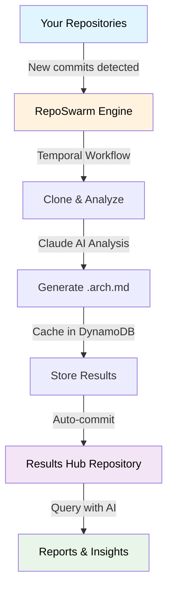

# 🤖 RepoSwarm

<p align="center">
  
</p>

<p align="center">
  <strong>AI-powered multi-repo architecture discovery platform</strong>
</p>

<p align="center">
  <a href="https://github.com/reposwarm/reposwarm/blob/main/LICENSE"></a>
  <a href="https://www.python.org/downloads/"></a>
  <a href="https://www.youtube.com/watch?v=rOMf9xvpgtc"></a>
</p>

<p align="center">
  <a href="#quick-start">Quick Start</a> •
  <a href="#what-is-reposwarm">What Is It</a> •
  <a href="#how-it-works">How It Works</a> •
  <a href="#ecosystem">Ecosystem</a> •
  <a href="#contributing">Contributing</a>
</p>

> **📦 Previously `loki-bedlam/repo-swarm`. Moved to the [RepoSwarm organization](https://github.com/reposwarm). Old URLs redirect automatically.**

---

## Quick Start

Install the CLI and bootstrap everything in one shot:

```bash
curl -fsSL https://raw.githubusercontent.com/reposwarm/reposwarm-cli/main/install.sh | sh
```

Then:

```bash
reposwarm new --local             # Bootstrap everything: Temporal, API, Worker, UI
reposwarm doctor                  # Full health check
reposwarm repos add my-app --url https://github.com/org/my-app
reposwarm investigate my-app      # Run your first investigation
reposwarm dashboard               # Watch it work
```

That's it. The CLI handles setup, configuration, investigation, diagnostics, and results — all from a single binary.

👉 **Full CLI docs:** [**reposwarm-cli**](https://github.com/reposwarm/reposwarm-cli)

---

## What is RepoSwarm?

RepoSwarm automatically analyzes your entire codebase portfolio and generates standardized architecture documentation. Point it at your GitHub repos (or CodeCommit, GitLab, Azure DevOps, Bitbucket) and get back clean, structured `.arch.md` files — perfect as AI agent context, onboarding docs, or architecture reviews.

<p align="center">
  
</p>

### ✨ Key Features

- 🔍 **AI-Powered Analysis** — Uses Claude to deeply understand codebases
- 📝 **Standardized Output** — Generates consistent `.arch.md` architecture files
- 🔄 **Incremental Updates** — Only re-analyzes repos with new commits
- 💾 **Smart Caching** — DynamoDB or file-based caching avoids redundant work
- 🎯 **Type-Aware Prompts** — Specialized analysis for backend, frontend, mobile, infra, and libraries
- 📦 **Results Hub** — All architecture docs committed to a centralized repository
- 🔌 **Multi-Provider** — Anthropic API, Amazon Bedrock, or LiteLLM proxy
- 🌐 **Multi-Git** — GitHub, GitLab, CodeCommit, Azure DevOps, Bitbucket

### 📋 See It In Action

Check out [RepoSwarm's self-analysis](https://github.com/royosherove/repo-swarm-sample-results-hub/blob/main/repo-swarm.arch.md) — RepoSwarm investigating its own codebase!

🎬 **Architecture Overview (click to play)**

[](https://www.youtube.com/watch?v=rOMf9xvpgtc)

---

## How It Works



**Pipeline:** Cache check → Clone → Type detection → Structure analysis → Prompt selection → AI analysis → Store results → Cleanup

---

## Common Workflows

### Run an Investigation

```bash
reposwarm repos add my-app --url https://github.com/org/my-app
reposwarm investigate my-app
reposwarm wf progress
reposwarm results read my-app
```

### Investigate All Repos in Parallel

```bash
reposwarm investigate --all --parallel 3
reposwarm dashboard
```

### Diagnose Issues

```bash
reposwarm doctor                       # Full health check
reposwarm errors                       # Stalls + failures
reposwarm wf retry <workflow-id>       # Re-run a failed investigation
```

### Search Across All Architecture Docs

```bash
reposwarm results search "authentication"
reposwarm results diff repo-a repo-b
reposwarm results export --all -d ./docs
```

👉 **Full command reference:** [**reposwarm-cli README**](https://github.com/reposwarm/reposwarm-cli)

---

## Configuration

### LLM Provider

```bash
reposwarm config provider setup        # Interactive (Anthropic, Bedrock, LiteLLM)
```

### Git Provider

```bash
reposwarm config git setup             # Interactive (GitHub, GitLab, CodeCommit, Azure, Bitbucket)
```

### Adding Repositories

```bash
reposwarm repos add my-backend --url https://github.com/org/my-backend
reposwarm repos add my-frontend --url https://github.com/org/my-frontend
reposwarm repos discover               # Auto-discover from CodeCommit
```

Or edit `prompts/repos.json` directly:

```json
{
  "repositories": {
    "my-backend": {
      "url": "https://github.com/org/my-backend",
      "type": "backend",
      "description": "Main API service"
    }
  }
}
```

### Analysis Prompt Types

| Type | Focus | Prompts |
|------|-------|---------|
| 🔧 **Backend** | APIs, databases, services | [`prompts/backend/`](prompts/backend/) |
| 🎨 **Frontend** | Components, routing, state | [`prompts/frontend/`](prompts/frontend/) |
| 📱 **Mobile** | UI, device features, offline | [`prompts/mobile/`](prompts/mobile/) |
| 📚 **Libraries** | API surface, internals | [`prompts/libraries/`](prompts/libraries/) |
| ☁️ **Infrastructure** | Resources, deployments | [`prompts/infra-as-code/`](prompts/infra-as-code/) |
| 🔗 **Shared** | Security, auth, monitoring | [`prompts/shared/`](prompts/shared/) |

---

## Ecosystem

| Project | Description | Install |
|---------|-------------|---------|
| ⌨️ [**reposwarm-cli**](https://github.com/reposwarm/reposwarm-cli) | CLI — setup, investigate, diagnose, results | `curl -fsSL .../install.sh \| sh` |
| 🔌 [**reposwarm-api**](https://github.com/reposwarm/reposwarm-api) | REST API server for repos, workflows, prompts | Managed by CLI |
| 📊 [**reposwarm-ui**](https://github.com/reposwarm/reposwarm-ui) | Next.js dashboard for browsing investigations | Managed by CLI |
| 🤖 **reposwarm** (this repo) | Core engine — Temporal workflows + analysis | Managed by CLI |
| 📋 [**sample-results-hub**](https://github.com/royosherove/repo-swarm-sample-results-hub) | Example output — generated `.arch.md` files | — |

---

## Project Structure

```
reposwarm/
├── prompts/                 # AI analysis prompts by repo type
│   ├── backend/            # API, database, service prompts
│   ├── frontend/           # UI, component, routing prompts
│   ├── mobile/             # Mobile app specific prompts
│   ├── libraries/          # Library/API prompts
│   ├── infra-as-code/      # Infrastructure prompts
│   ├── shared/             # Cross-cutting concerns
│   └── repos.json          # Repository configuration
├── src/
│   ├── investigator/       # Core analysis engine
│   │   └── core/          # Main analysis logic
│   ├── workflows/          # Temporal workflow definitions
│   ├── activities/         # Temporal activity implementations
│   ├── models/             # Data models and schemas
│   └── utils/              # Storage adapters and utilities
├── tests/                  # Unit and integration tests
└── temp/                   # Generated .arch.md files (local dev)
```

---

## Credits

RepoSwarm was born out of a hackathon at [Verbit](https://verbit.ai/), built by:
- [Moshe](https://github.com/mosher)
- [Idan](https://github.com/Idandos)
- [Roy](https://github.com/royosherove)

---

## Contributing

1. Fork the repository
2. Create a feature branch
3. Make changes and add tests
4. Submit a pull request

---

## License

This project is licensed under the [Polyform Noncommercial License 1.0.0](LICENSE).
You may use, copy, and modify the code for non-commercial purposes only.
For commercial licensing, contact roy at osherove dot com.
